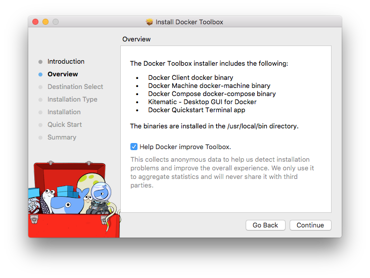

> ## Deprecation Notice :warning:
>
> Docker Toolbox is deprecated and is no longer in active development. Please use
> [Docker Desktop](https://www.docker.com/products/docker-desktop) instead where
> possible.

# Docker Toolbox overview

Docker Toolbox is an installer for quick setup and launch of a Docker environment on older Mac and Windows systems that do not meet the requirements of the new [Docker Desktop for Mac](https://docs.docker.com/docker-for-mac/) and [Docker Desktop for Windows](https://docs.docker.com/docker-for-windows/) apps.

## What's in the box

Toolbox includes these Docker tools:

* Docker Machine for running `docker-machine` commands

* Docker Engine for running the `docker` commands

* Docker Compose for running the `docker-compose` commands

* Kitematic, the Docker GUI

* a shell preconfigured for a Docker command-line environment

* Oracle VirtualBox

You can find various versions of the tools on [Toolbox Releases](https://github.com/docker/toolbox/releases) or run them with the `--version` flag in the terminal, for example, `docker-compose --version`.

## Ready to get started?

Choose the install instructions for your platform, and follow the steps:

 - [Install Docker Toolbox for macOS](toolbox_install_mac.md)

 - [Install Docker Toolbox for Windows](toolbox_install_windows.md)

